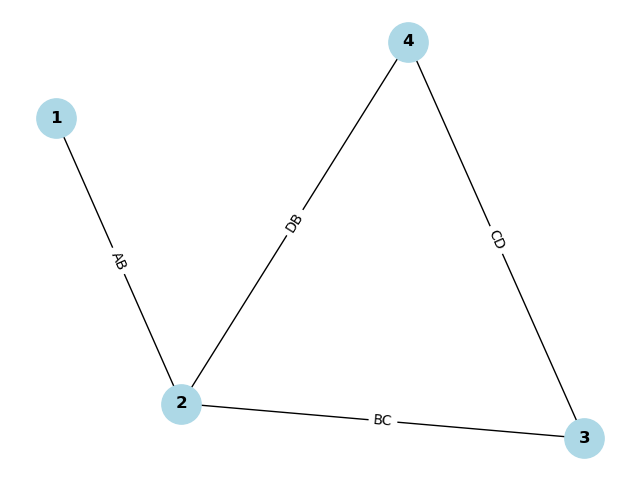

# Wizualizacja grafu planarnego

## Opis zadania projektowego

Zadanie polega na stworzeniu aplikacji która ma wyznaczać współrzędne węzłów dla "ładnej" wizualizacji grafu planarnego podanego w postaci listy krawędzi.

## Użycie

1. `make` - zbudowanie programu
2. `a.out <plik wejsciowy> [dodatkowe argumenty]`

Pomocny skrypt w python do zwizualizowania działania programu (wymaga bibliotek `matplotlib` oraz `networkx`):

`python3 visualize.py <plik z krawedziami> <plik ze wspolrzednymi>`

## Przykład

Plik z krawędziami:

```
AB   1  2  1
BC   2  3  1
CD   3  4  1
DB   4  2  1.407
```

Plik wyjściowy:

```
1 72.0 81.0
2 77.0 40.0
3 93.0 35.0
4 86.0 92.0
```

Wynik działania skryptu w python dla powyższych danych:

